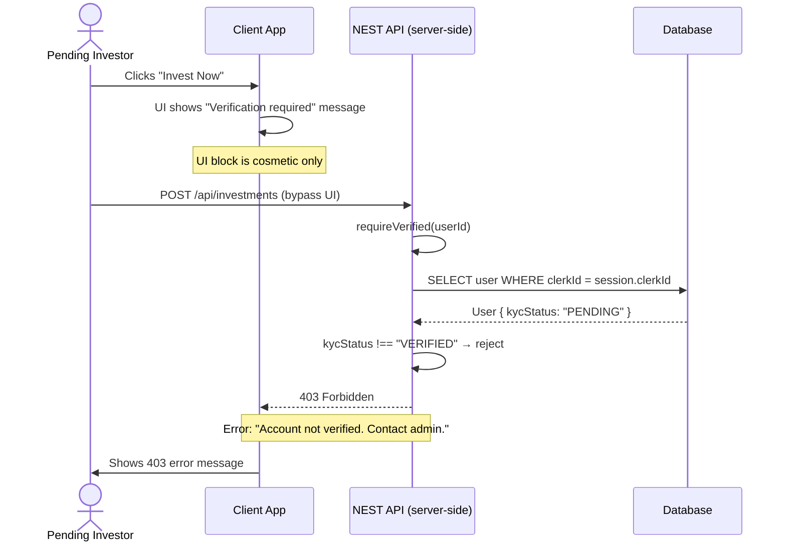
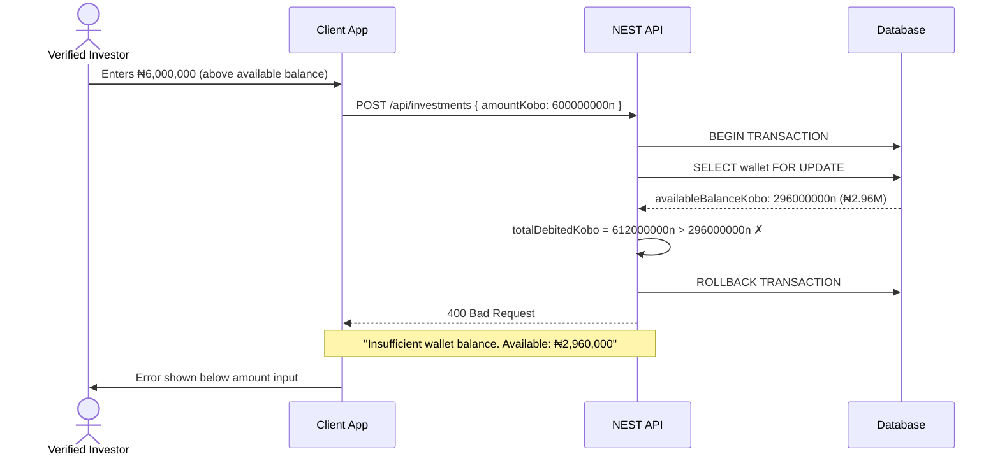
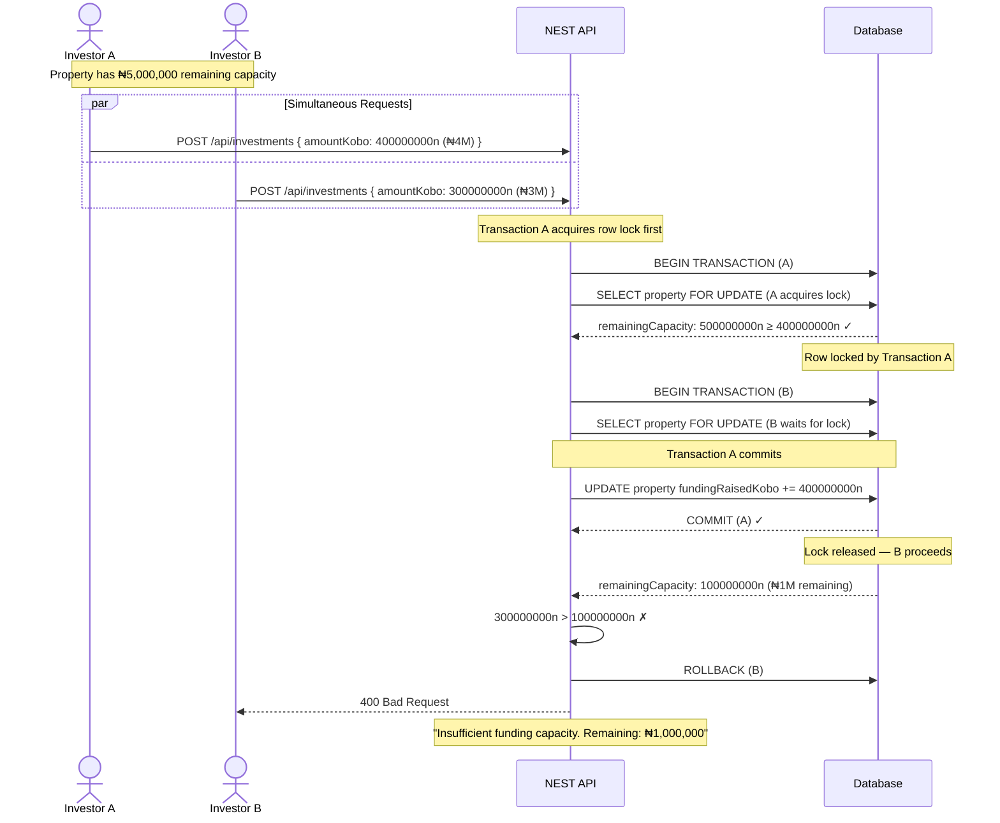
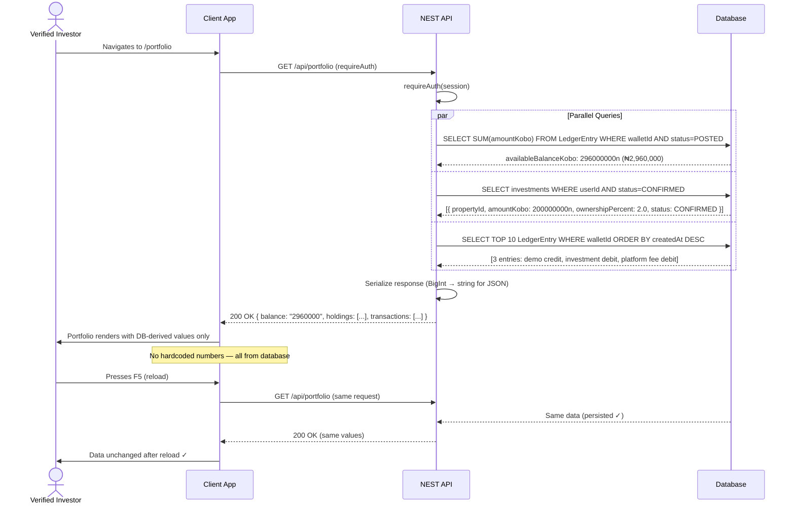

# NEST by Nulo Africa — Sequence Diagrams

**Version:** 2.0
**Date:** September 16, 2026
**Status:** Updated — Aligned with requirements.md v2.0
**Source of Truth:** `docs_gstack/requirements.md` v2.0

---

## Scope Note

All amounts use ₦100,000,000 funding target, ₦500,000 minimum investment, and 2% platform fee. The 8% AUM management fee has been removed. These diagrams cover the 5 Must-have demo features only.

---

## Diagram 1: Authorization Matrix

### Investor PENDING → Investment Blocked



---

## Diagram 2: Admin Demo Credit

### Happy Path: Admin Credits Demo Wallet

```mermaid
sequenceDiagram
    actor Admin
    participant App as Admin Panel
    participant API as NEST API
    participant Ledger as Ledger Service
    participant DB as Database

    Admin->>App: Selects investor; enters ₦5,000,000 demo credit
    Admin->>App: Clicks "Credit Demo Wallet"

    App->>API: POST /api/admin/wallet/credit
    Note over App,API: { userId, amountKobo: 500000000n, reference: "DEMO-CREDIT-ADAEZE-001" }

    API->>API: requireAdmin(session.userId)
    API->>DB: SELECT user WHERE id = userId (confirm exists + INVESTOR role)
    DB-->>API: User found

    API->>DB: SELECT ledgerEntry WHERE reference = "DEMO-CREDIT-ADAEZE-001"
    DB-->>API: No existing entry (idempotency check passes)

    API->>DB: BEGIN TRANSACTION
    API->>Ledger: credit(walletId, 500000000n, "DEMO_CREDIT", "DEMO-CREDIT-ADAEZE-001")
    Ledger->>DB: INSERT LedgerEntry (amountKobo: +500000000n, type: DEMO_CREDIT, label: "DEMO CREDIT — NOT A PAYMENT")
    Ledger->>DB: UPDATE Wallet SET availableBalanceKobo = 0 + 500000000n
    API->>DB: INSERT AuditLog (action: DEMO_CREDIT_ISSUED, entityId: wallet.id)
    DB-->>API: COMMIT TRANSACTION ✓

    API-->>App: 201 Created { balance: "₦5,000,000 (TEST MODE)" }
    App->>Admin: "Demo credit issued: ₦5,000,000 — TEST MODE"

### Exception Path: Duplicate Reference (Idempotency)

sequenceDiagram
    actor Admin
    participant App as Admin Panel
    participant API as NEST API
    participant DB as Database

    Admin->>App: Submits same demo credit request again
    App->>API: POST /api/admin/wallet/credit (same reference)

    API->>DB: SELECT ledgerEntry WHERE reference = "DEMO-CREDIT-ADAEZE-001"
    DB-->>API: Found existing entry (idempotency hit)

    API-->>App: 200 OK (returns existing ledger entry — no new write)
    Note over API,App: "Demo credit already issued for this reference."
    App->>Admin: Shows existing credit (no duplicate)
```

---

## Diagram 3: Atomic Investment Transaction

### Happy Path: Successful Investment

```mermaid
sequenceDiagram
    actor User as Verified Investor
    participant App as Client App
    participant API as NEST API
    participant Ledger as Ledger Service
    participant DB as Database

    User->>App: Enters amount ₦2,000,000; checks all consent boxes
    App->>App: Client validates: ₦2M ≥ ₦500K ✓, ₦2M ≤ ₦10M ✓
    App->>App: Displays: fee ₦40K, total debit ₦2.04M, ownership 2.0% (principal÷target), projection 7-9% of ₦2M principal (labelled PROJECTION ONLY)
    User->>App: All checkboxes checked → Confirm enabled
    User->>App: Clicks "Confirm Investment"

    App->>API: POST /api/investments
    Note over App,API: { propertyId, amountKobo: 200000000n, idempotencyKey: [UUID] }

    API->>API: requireVerified(userId) → kycStatus == VERIFIED ✓
    API->>API: Check idempotencyKey not already in Investment table

    API->>DB: BEGIN TRANSACTION

    API->>DB: SELECT wallet FOR UPDATE WHERE userId
    DB-->>API: availableBalanceKobo: 500000000n (₦5M)

    API->>API: Validate:
    Note over API: amountKobo 200000000n ≥ minInvestmentKobo 50000000n ✓
    Note over API: amountKobo 200000000n ≤ maxInvestmentKobo 1000000000n ✓
    Note over API: platformFeeKobo = 200000000n × 0.02 = 4000000n
    Note over API: totalDebitedKobo = 204000000n ≤ 500000000n ✓

    API->>DB: SELECT property FOR UPDATE WHERE id
    DB-->>API: fundingTargetKobo: 10000000000n, fundingRaisedKobo: 500000000n (Fatima pre-seeded ₦5M)
    API->>API: remainingCapacity = 9500000000n ≥ 200000000n ✓

    API->>Ledger: debit(walletId, 200000000n, "INVESTMENT_DEBIT", "INV-REF-001")
    Ledger->>DB: INSERT LedgerEntry (amountKobo: -200000000n, type: INVESTMENT_DEBIT)

    API->>Ledger: debit(walletId, 4000000n, "PLATFORM_FEE", "FEE-REF-001")
    Ledger->>DB: INSERT LedgerEntry (amountKobo: -4000000n, type: PLATFORM_FEE)

    API->>DB: UPDATE Wallet SET availableBalanceKobo = 500000000n - 204000000n = 296000000n

    API->>DB: INSERT Investment { amountKobo: 200000000n, platformFeeKobo: 4000000n, ownershipPercent: 2.0, status: CONFIRMED, termsConsentVersion: "v1.0-...", termsConsentAt: [now] }
    API->>DB: UPDATE Property SET fundingRaisedKobo = 500000000n + 200000000n = 700000000n (₦7M total; 7.0% of target)
    API->>DB: INSERT AuditLog (action: INVESTMENT_CREATED)
    API->>DB: INSERT Notification (type: INVESTMENT_CONFIRMED)

    DB-->>API: COMMIT TRANSACTION ✓

    API-->>App: 201 Created { investmentId, receiptNumber: "INV-20260916-001", ownershipPercent: 2.0, status: "CONFIRMED" }
    App->>User: Investment Success screen with receipt, ownership %, TEST MODE label
```

### Exception Path: Insufficient Balance



### Exception Path: Property Fully Funded (Concurrent Request)



---

## Diagram 4: Portfolio Load

### Happy Path: Portfolio Dashboard



---

## Diagram 5: Admin Distribution

### Happy Path: Quarterly Demo Distribution

```mermaid
sequenceDiagram
    actor Admin
    participant App as Admin Panel
    participant API as NEST API
    participant Ledger as Ledger Service
    participant DB as Database

    Admin->>App: Selects property, period "Q4-2026-DEMO", rent ₦1,200,000
    App->>App: Calculates: management fee (8% of rent) = ₦96,000; net = ₦1,104,000
    Admin->>App: Clicks "Calculate Pro-rata"

    App->>API: POST /api/admin/distributions
    Note over App,API: { propertyId, period: "Q4-2026-DEMO", totalRentKobo: 120000000n }
    API->>API: requireAdmin(session)
    API->>DB: SELECT investments WHERE propertyId AND status=CONFIRMED
    DB-->>API: [Adaeze: 2.0%, Fatima: 5.0%]
    API->>API: Calculate allocations (integer arithmetic)
    Note over API: Fatima (5.0% of ₦100M funded): 110400000n × 5.0% = 5520000n (₦55,200)
    Note over API: [Adaeze not yet invested at preview time in base demo — will show 2.0% if invested]
    Note over API: Unfunded 95.0%: 104880000n held in reserve
    Note over API: Total: 5520000n + 104880000n = 110400000n ✓ (zero remainder)
    API-->>App: Preview table (allocation per investor, reserve amount)

    Admin->>App: Reviews allocation; clicks "Execute Distribution"
    App->>API: POST /api/admin/distributions (action: execute, with confirmed allocations)
    Note over App,API: { propertyId, period: "Q4-2026-DEMO", totalRentKobo, managementFeeKobo, allocations }

    API->>API: requireAdmin(session)
    API->>DB: SELECT distribution WHERE propertyId="prop-demo-001" AND period="Q4-2026-DEMO"
    DB-->>API: No existing distribution (idempotency check passes)

    API->>DB: BEGIN TRANSACTION

    loop For each investor (Adaeze, Fatima)
        API->>Ledger: credit(walletId, allocationKobo, "DISTRIBUTION_CREDIT", "DIST-Q4-2026-DEMO-[userId]")
        Ledger->>DB: INSERT LedgerEntry (amountKobo: +allocationKobo, type: DISTRIBUTION_CREDIT)
        Ledger->>DB: UPDATE Wallet.availableBalanceKobo += allocationKobo
        API->>DB: INSERT Notification (type: DISTRIBUTION_RECEIVED)
    end

    API->>DB: INSERT Distribution { propertyId, period, totalRentCollectedKobo, managementFeeKobo, netDistributedKobo, investorCount }
    API->>DB: INSERT AuditLog (action: DISTRIBUTION_EXECUTED)
    DB-->>API: COMMIT TRANSACTION ✓

    API-->>App: 200 OK { distributionId, summary }
    App->>Admin: "Distribution complete — TEST MODE. 2 investors credited."
```

### Exception Path: Duplicate Distribution

```mermaid
sequenceDiagram
    actor Admin
    participant App as Admin Panel
    participant API as NEST API
    participant DB as Database

    Admin->>App: Attempts Q4-2026-DEMO distribution again
    App->>API: POST /api/admin/distributions/execute

    API->>DB: SELECT distribution WHERE (propertyId, period) = ("prop-demo-001", "Q4-2026-DEMO")
    DB-->>API: Found existing distribution (unique constraint hit)

    API-->>App: 409 Conflict { error: "DISTRIBUTION_ALREADY_EXECUTED", period: "Q4-2026-DEMO" }
    Note over API,App: No wallets credited; no ledger entries created
    App->>Admin: Shows existing distribution summary; no new credits issued
```

---

**Document Status:** Complete
**Source of Truth:** requirements.md v2.0
**Last Updated:** September 16, 2026

